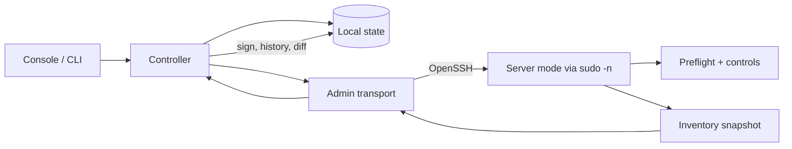
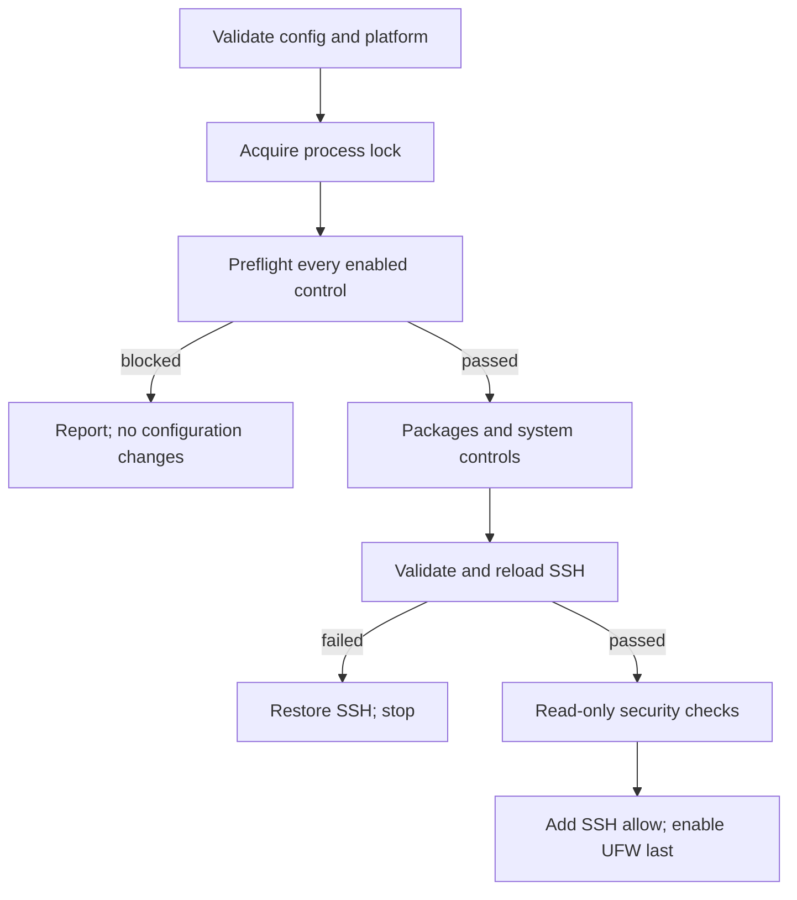

# Архитектура

## Цели

Главный приоритет — простая поддержка и сборка:

- один Go-модуль и один исполняемый файл на платформу;
- только стандартная библиотека;
- OpenSSH вместо собственного сетевого протокола;
- локальное файловое хранилище вместо базы данных;
- постоянный агент на сервере отсутствует;
- явные платформенные границы и версионированные JSON-схемы.

## Компоненты

| Пакет | Ответственность |
|---|---|
| `cmd/bastionctl` | entry point, сигналы, версия сборки |
| `internal/cli` | команды, параметры, коды завершения, JSON/text |
| `internal/console` | интерактивное меню администратора и подтверждения |
| `internal/controller` | операции над реестром, установка, история, snapshots |
| `internal/state` | атомарное локальное хранилище и подписи Ed25519 |
| `internal/config` | строгий TOML subset, defaults, validation, rendering |
| `internal/profile` | встроенные стартовые политики сервисов |
| `internal/admin` | диагностика, проверка target, безопасные `ssh`/`scp` |
| `internal/server` | Linux-контроли, preflight, apply, backup/rollback |
| `internal/inventory` | snapshot и детерминированный drift diff |
| `internal/explain` | назначение, риск, проверка и откат контролей |
| `internal/report` | `bastionctl.report.v1` и renderers |

Non-Linux-сборки содержат полный режим администратора. Server `apply` на них
явно отклоняется. Linux-сборка содержит оба режима.

## Поток управления

Реестр хранит connection metadata и путь к управляемой политике, но не пароли.
`Identity` — только путь к закрытому ключу. Для password bootstrap отдельный
Ed25519-ключ создаётся внутри защищённого state-каталога; его содержимое читает
только OpenSSH.

## Жизненный цикл apply

Порядок контролей фиксирован в исходном коде. Ошибка останавливает следующие
контроли. Firewall стоит последним, поэтому сбой пакетов, validators, прав, SSH
или Fail2ban не может завершиться включением firewall.

Интерактивный контроллер дополнительно выполняет отдельный `plan` и требует
точную строку `APPLY <server-id>`. Низкоуровневый CLI требует `--yes`, чтобы
оставаться пригодным для автоматизации.

## Модель изменения файлов

Для каждого управляемого серверного файла:

1. отклоняется symlink target или parent component;
2. существующий regular file копируется в run-specific backup;
3. same-directory temporary file получает явные owner/mode;
4. данные синхронизируются и атомарно переименовываются;
5. выполняются validator и activation command;
6. при ошибке восстанавливается прежний файл.

Установка пакетов, исправление metadata и правила UFW честно отмечаются как
нетранзакционные операции.

## SSH и bootstrap

Target имеет строгий формат `user@host`; port и identity проверяются до запуска.
Пользовательские данные не превращаются в local shell. Удалённая команда
состоит из фиксированных токенов с POSIX quoting и обычно выполняется через
`sudo -n`; интерактивная установка использует удалённый TTY и штатный `sudo`.

Host-key policy по умолчанию — `StrictHostKeyChecking=yes`. Явный relaxed mode
для готового ключа использует только `accept-new`, никогда не принимает
изменившийся ключ. Password bootstrap вместо этого использует `ask`: оператор
должен независимо сверить показанный fingerprint до ответа `yes` и ввода
пароля. После тестового входа новым ключом policy становится строгой.

Installer сначала определяет `uname -m`, проверяет ELF class/machine выбранного
бинарника, загружает файлы во временные случайные пути, сверяет SHA-256, проверяет
sudoers через `visudo -cf`, затем устанавливает root-owned файлы. Первый вход
может установить ключ существующему пользователю либо при входе от root создать
непривилегированного администратора. Пароли обрабатывают только OpenSSH,
удалённый `passwd` и `sudo`; приложение не получает их байты.

## Локальное состояние

Файлы реестра, политик, истории и snapshots пишутся через temporary + sync +
rename; final symlink отклоняется. `config_path` реестра обязан указывать на
ожидаемый файл внутри выбранного state root.

Snapshot подписывается локальным Ed25519-ключом. При чтении проверяются и
signature, и совпадение embedded public key с локально доверенным ключом. Это
обнаруживает случайную/частичную подмену, но не защищает от атакующего, который
полностью контролирует аккаунт администратора и украл private key.

## Совместимость

Модуль объявляет Go 1.22. Release-сборки используют `CGO_ENABLED=0`, не имеют
внешних модулей и создаются для Linux amd64/arm64, Windows amd64, macOS
amd64/arm64. Серверные контроли рассчитаны на поддерживаемые Debian/Ubuntu с
apt и systemd.
