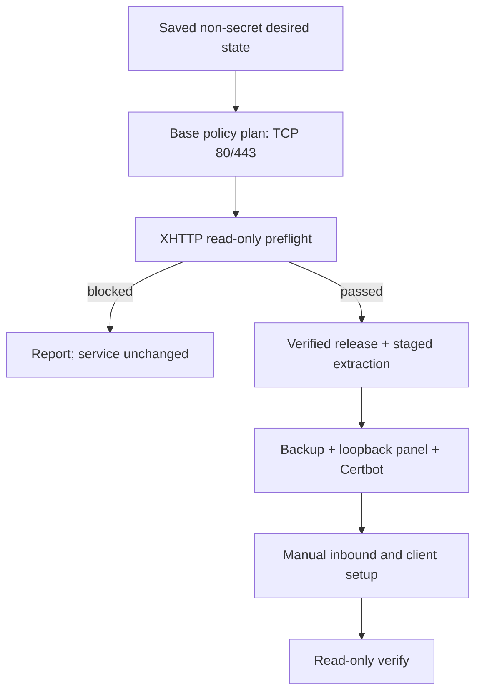
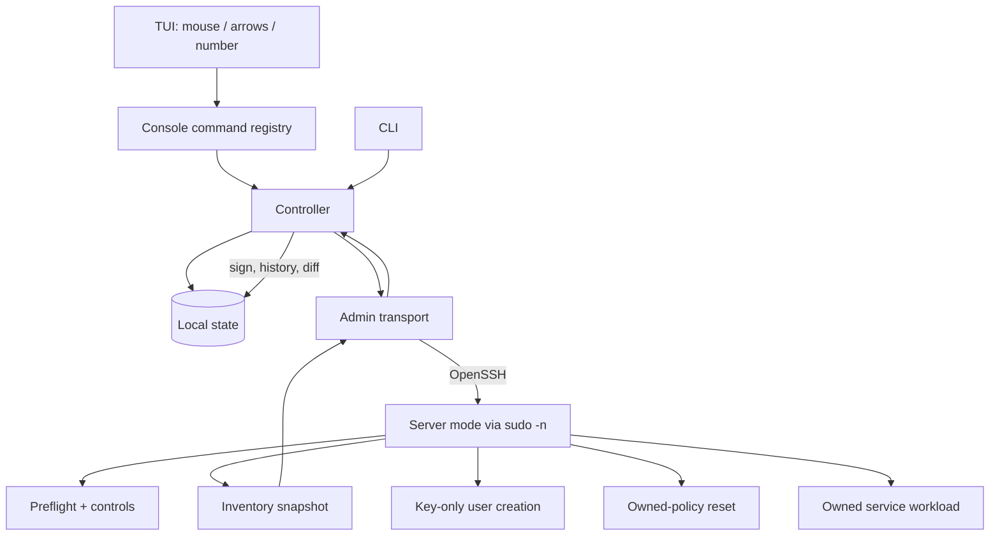
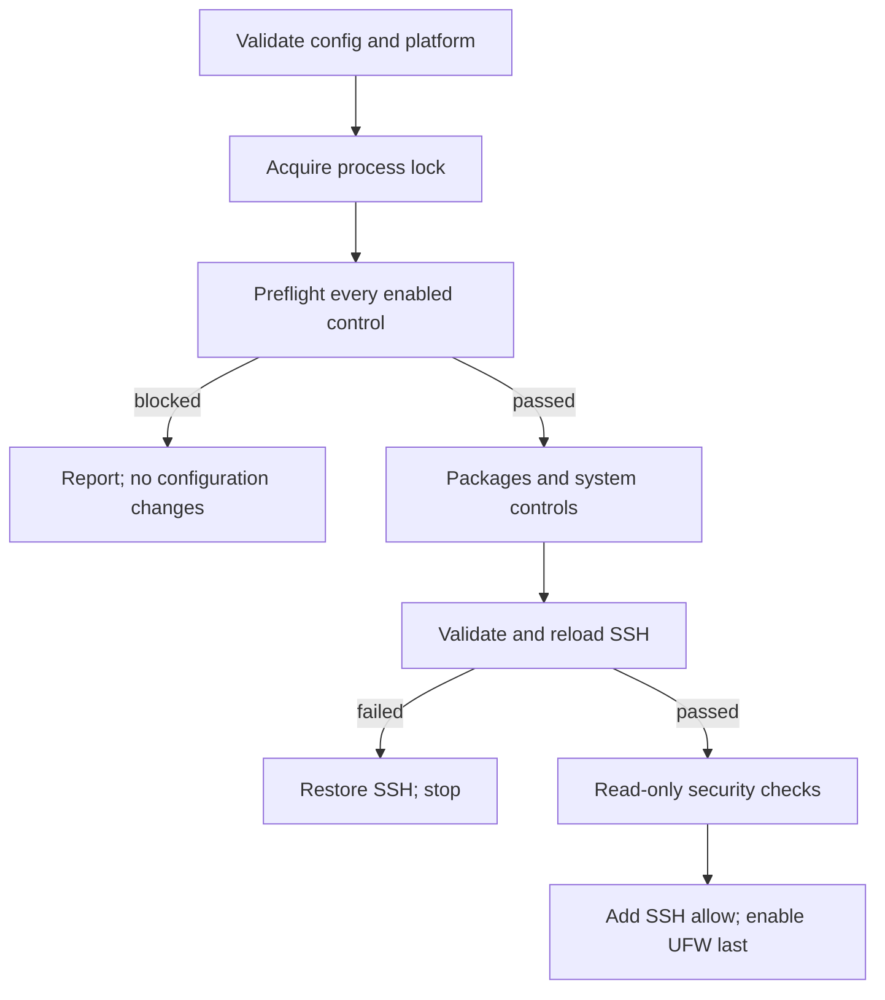
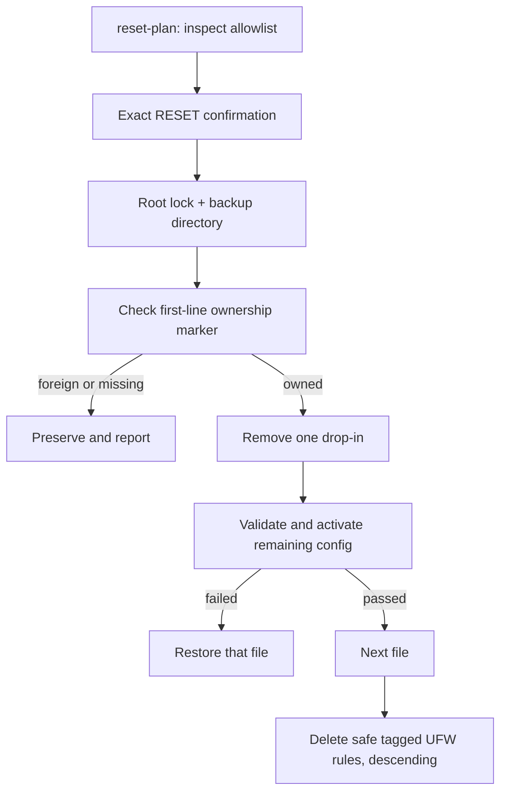

# Архитектура

## Цели

Главный приоритет — простая поддержка и сборка:

- один Go-модуль и один исполняемый файл на платформу;
- только стандартная библиотека;
- OpenSSH вместо собственного сетевого протокола;
- локальное файловое хранилище вместо базы данных;
- постоянный агент на сервере отсутствует;
- явные платформенные границы и версионированные JSON-схемы.
- при росте ответственности предпочтительна переработка связной границы
  пакета, а не добавление локального workaround в существующий поток.

## Компоненты

| Пакет | Ответственность |
|---|---|
| `cmd/bastionctl` | entry point, сигналы, версия сборки |
| `internal/cli` | команды, параметры, коды завершения, JSON/text |
| `internal/console` | реестр действий панели, сценарии и подтверждения |
| `internal/tui` | адаптивный layout, mouse/keyboard events и terminal lifecycle |
| `internal/controller` | orchestration реестра, политик, workload, истории и snapshots |
| `internal/state` | атомарное локальное хранилище и подписи Ed25519 |
| `internal/config` | строгий TOML subset, defaults, validation, rendering |
| `internal/profile` | встроенные стартовые политики сервисов |
| `internal/admin` | диагностика, проверка target, безопасные `ssh`/`scp` |
| `internal/server` | Linux-контроли, preflight, apply, backup/rollback |
| `internal/workload` | сервисные desired state, plan/apply/verify и ручные инструкции |
| `internal/sshkey` | единая проверка usernames, Ed25519-ключей и fingerprints |
| `internal/inventory` | snapshot и детерминированный drift diff |
| `internal/explain` | назначение, риск, проверка и откат контролей |
| `internal/report` | `bastionctl.report.v1` и renderers |

Non-Linux-сборки содержат полный режим администратора. Server `apply` на них
явно отклоняется. Linux-сборка содержит оба режима. Платформенная реализация
workload также отделена build tags и на non-Linux явно возвращает отказ.

## Workload VLESS + TLS + XHTTP

Сервисная настройка не встроена в базовые SSH/UFW-контроли. Она реализована как
отдельный модуль `internal/workload` с собственной версионированной схемой
`bastionctl.workload.xhttp.v1`, ownership-marker, backup-контуром и действиями
`plan`, `apply`, `verify`. Это позволяет развивать или удалить модуль без
ветвления общего hardening engine.

На ПК сохраняются только domain, ACME email, ожидаемый публичный IP, локальный
порт/путь панели и закреплённая версия. Этот JSON передаётся через stdin точной
sudo-команды, а не расширяет командную строку. Учётные данные генерируются на
сервере, пишутся в `/etc/bastionctl/workloads/xhttp-access.txt` с правами 0600
в каталоге 0700, не попадают в отчёт и должны быть удалены после первого входа.

Linux runner допускает только amd64/arm64 asset одного release и проверяет
полный SHA-256 до распаковки. Redirect ограничен HTTPS allowlist, а tar reader
отклоняет absolute/traversal paths, symlink, hardlink, device и превышение
лимитов. Существующая установка без marker не принимается автоматически.
Управляемая установка обновляется только при полном совпадении desired state;
неявная миграция домена или панели запрещена.
Официальный systemd unit сохраняется отдельно от bastionctl drop-in. Drop-in
задаёт `UMask=0077`, `NoNewPrivileges`, private tmp, protected home/kernel/
control groups и запрет SUID/SGID; эффективные свойства читаются через
`systemctl show`. База, log directory и workload credentials принадлежат root и
закрыты от остальных пользователей. Управляемый `/etc/default/x-ui` фиксирует
SQLite backend и не позволяет случайно унаследовать посторонний DSN/environment.

Публичны только TCP 80/443. Панель принудительно привязана к `127.0.0.1` и
открывается через SSH port forwarding. Создание VLESS/XHTTP inbound, UUID,
клиентского профиля, 2FA и проверка конкретной сети остаются явными ручными
шагами: они зависят от версии UI и пользовательского клиента и не требуют от
bastionctl хранить application secrets.

Workload запрашивает сетевую возможность через общую desired policy, а не
пишет второй SSH drop-in. Контроллер добавляет TCP 80/443 и одно назначение
`127.0.0.1:PANEL_PORT` в `ssh_local_forward_destinations`. Основной SSH-контроль
генерирует в своём атомарно проверяемом drop-in блок `Match User ADMIN` с
`AllowTcpForwarding local`, точным `PermitOpen` и завершающим `Match all`.
`sshd -T -C` отдельно проверяет администратора и постороннего пользователя,
поэтому исключение не превращается в глобальный forwarding.
Общий policy reconciler повторно добавляет эти требования при смене профиля или
ручном редактировании базовой политики, пока workload desired state существует;
редактирование порта панели одновременно заменяет старый `PermitOpen`.

Обычный reset базовой политики не пересекает ownership workload. Пакеты,
Certbot state, сертификаты и 3x-ui не удаляются этой командой. Узкое правило
туннеля находится в общем SSH drop-in и исчезает вместе с ним; сервис остаётся
loopback-only до повторного apply политики. Отдельный uninstall должен иметь
собственный plan, dependency checks и confirmation.

## Поток управления

## Интерактивный терминал

`internal/console` больше не хранит отдельные копии пунктов в печатной таблице
и в `switch`. Один реестр команд содержит номер, подпись, смысловую группу,
совместимые текстовые алиасы и обработчик. Из него одновременно строятся
кликабельное меню и line-mode fallback.

`internal/tui` не знает о серверах или контролях. Он получает только список
опций, раскладывает смысловые группы максимум в четыре столбца и уменьшает их
число по размеру терминала, после чего возвращает выбранный ID. На Linux/macOS
terminal mode сохраняется и временно
переключается через системный `stty`; на Windows используются Console API и VT
input. Mouse reporting и alternate screen активны только внутри `Select`.
Перед вызовом обработчика состояние восстанавливается через `defer`, поэтому
OpenSSH, `sudo`, `passwd` и обычные вопросы всегда получают нормальный TTY.

При pipe, тестовом `io.Reader` или неподдерживаемом terminal mode `Select`
ничего не меняет и сообщает консоли использовать текстовый fallback. Таким
образом mouse UI является дополнительным способом управления, а не новой
обязательной зависимостью.

Реестр хранит connection metadata и путь к управляемой политике, но не пароли.
`Identity` — только путь к закрытому ключу. Для password bootstrap отдельный
Ed25519-ключ создаётся внутри защищённого state-каталога; его содержимое читает
только OpenSSH.

## Жизненный цикл apply

Порядок контролей фиксирован в исходном коде. Ошибка останавливает следующие
контроли. Firewall стоит последним, поэтому сбой пакетов, validators, прав, SSH
или Fail2ban не может завершиться включением firewall.

Интерактивный контроллер дополнительно выполняет отдельный `plan` и требует
точную строку `APPLY <server-id>`. Низкоуровневый CLI требует `--yes`, чтобы
оставаться пригодным для автоматизации.

## Жизненный цикл reset

Reset не пытается реконструировать неизвестное состояние ОС до установки.
Пакеты, shared service state, UFW enable/default policy, аккаунты,
`authorized_keys`, home и данные приложений остаются неизменными. Это делает
операцию идемпотентной и ограничивает область записи явным allowlist.
При active UFW с deny/reject incoming помеченный SSH allow сохраняется: reset
не должен превращать отмену hardening в потерю управления сервером.

## Создание пользователя

Публичный ключ нормализуется на admin-ПК и повторно на сервере. Версионированный
JSON `bastionctl.user-add.v1` передаётся через stdin фиксированной sudo-команды,
поэтому username и ключ не расширяют sudo command line. Сервер допускает только
UID >= 1000, обычный home без symlink и login shell. `.ssh` открывается как
каталог с `O_NOFOLLOW`; `authorized_keys` открывается относительно descriptor
через `openat`, блокируется, проверяется и только дополняется. Закрытый ключ в
этот поток не входит.

Роль sudo опциональна. После добавления группы пароль задаётся отдельным
интерактивным `sudo passwd`; его байты остаются между терминалом, OpenSSH и
удалёнными `sudo`/`passwd`.

## Модель изменения файлов

Для каждого управляемого серверного файла:

1. отклоняется symlink target или parent component;
2. существующий regular file копируется в run-specific backup;
3. same-directory temporary file получает явные owner/mode;
4. данные синхронизируются и атомарно переименовываются;
5. выполняются validator и activation command;
6. при ошибке восстанавливается прежний файл.

Установка пакетов, исправление metadata и правила UFW честно отмечаются как
нетранзакционные операции. Reset сохраняет исходный numbered status UFW перед
удалением помеченных правил и сообщает частичный результат при ошибке.

## SSH и bootstrap

Target имеет строгий формат `user@host`; port и identity проверяются до запуска.
Пользовательские данные не превращаются в local shell. Удалённая команда
состоит из фиксированных токенов с POSIX quoting и обычно выполняется через
`sudo -n`; интерактивная установка использует удалённый TTY и штатный `sudo`.

Host-key policy по умолчанию — `StrictHostKeyChecking=yes`. Явный relaxed mode
для готового ключа использует только `accept-new`, никогда не принимает
изменившийся ключ. Password bootstrap вместо этого использует `ask`: оператор
должен независимо сверить показанный fingerprint до ответа `yes` и ввода
пароля. После тестового входа новым ключом policy становится строгой.

Installer сначала определяет `uname -m`, проверяет ELF class/machine выбранного
бинарника, загружает файлы во временные случайные пути, сверяет SHA-256, проверяет
sudoers через `visudo -cf`, затем устанавливает root-owned файлы. Первый вход
может установить ключ существующему пользователю либо при входе от root создать
непривилегированного администратора. Пароли обрабатывают только OpenSSH,
удалённый `passwd` и `sudo`; приложение не получает их байты. В sudoers также
перечислены точные `reset-plan`, `reset`, `user-add` и три действия
`workload xhttp`; переменные запросы `user-add`/`xhttp` поступают только через
stdin.

## Локальное состояние

Файлы реестра, политик, workload desired state, истории и snapshots пишутся
через temporary + sync + rename; final symlink отклоняется. `config_path`
реестра обязан указывать на ожидаемый файл внутри выбранного state root.

Snapshot подписывается локальным Ed25519-ключом. При чтении проверяются и
signature, и совпадение embedded public key с локально доверенным ключом. Это
обнаруживает случайную/частичную подмену, но не защищает от атакующего, который
полностью контролирует аккаунт администратора и украл private key.

## Совместимость

Модуль объявляет Go 1.22. Release-сборки используют `CGO_ENABLED=0`, не имеют
внешних модулей и создаются для Linux amd64/arm64, Windows amd64, macOS
amd64/arm64. Серверные контроли рассчитаны на поддерживаемые Debian/Ubuntu с
apt и systemd.
