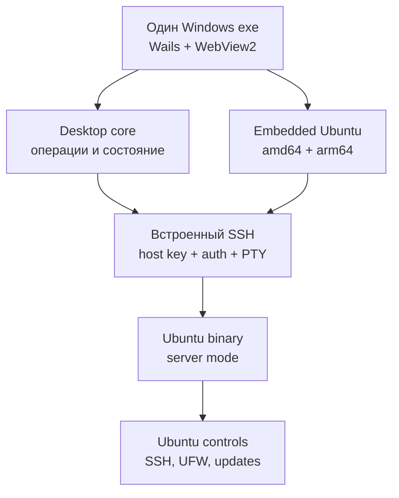
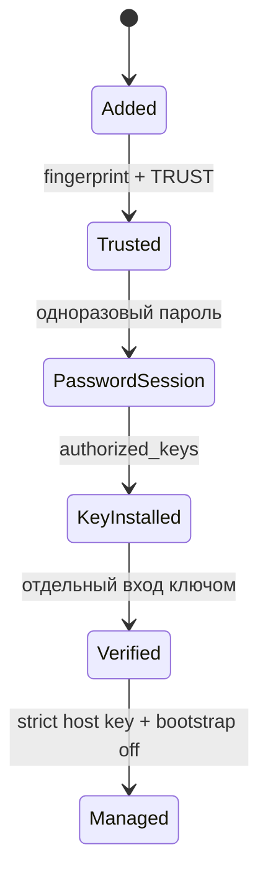
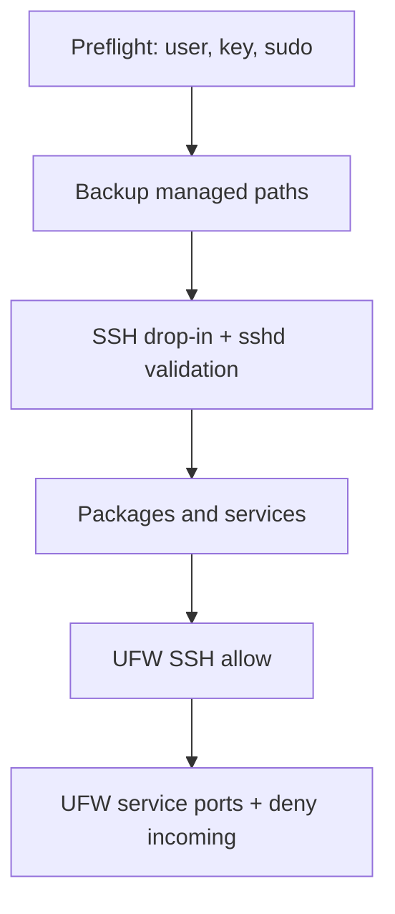

# Архитектура bastionctl 2.2

## Целевая модель

Версия 2.2 разделяет продукт на две явно разные роли:



- Windows-приложение владеет интерфейсом, локальным реестром, историей,
  snapshots и SSH-сессиями.
- Ubuntu-бинарник является headless command runner. Он не слушает сеть и не
  работает постоянно.
- SSH остаётся единственной сетевой границей. Проприетарный agent/protocol не
  добавляется.

Будущие desktop- и server-платформы должны подключаться через новые адаптеры,
а не через условные ветки внутри контролов.

## Слои

| Слой | Пакеты | Ответственность |
|---|---|---|
| Windows shell | `cmd/bastionctl-desktop`, `internal/desktopui`, `ui/windows` | Native window, WebView2 assets, события и lifecycle |
| Desktop application | `internal/desktop` | View models, подтверждения, workflows, отсутствие секретов в state |
| Domain controller | `internal/controller`, `internal/state`, `internal/profile` | Реестр, policy, история, snapshots, orchestration |
| SSH transport | `internal/terminal`, `internal/admin` | Pinned host key, key/password auth, memory/file upload, PTY |
| Embedded payload | `internal/serverpayload` | Выбор и проверка встроенного Ubuntu ELF для архитектуры сервера |
| Ubuntu runtime | `cmd/bastionctl`, `internal/server`, `internal/workload` | Audit/plan/apply/reset и workload controls |
| Compatibility UI | `internal/console`, `internal/tui`, `internal/cli` | Rescue/automation CLI и прежний TUI |

Desktop UI не формирует root-команды из произвольных фрагментов. Оно передаёт
типизированные запросы application layer. `internal/admin` строит фиксированные
команды, сервер повторно валидирует JSON и выполняет только известные actions.

Главное окно содержит только список серверов и постоянный terminal host.
Административные разделы открываются отдельным диалогом «Управление»;
его закрытие не меняет terminal DOM или SSH-сессию. `presentation.js` хранит
разметку и тему, `console-session.js` отделяет события подключения от поздних
ответов Wails. При смене отключённого сервера очищаются экран и UTF-8 decoder.
Фон консоли прозрачный на 15% одним CSS-слоем; xterm canvas прозрачен полностью,
поэтому текст и курсор не получают общей opacity.

## SSH trust и credentials

Для каждого server ID создаётся отдельный каталог:

```text
servers/<id>/
  config.toml
  id_ed25519
  id_ed25519.pub
  known_hosts
  known_hosts.previous
  workloads/
```

`known_hosts` появляется только после повторного probe и точного подтверждения
`TRUST <fingerprint>`. И встроенный клиент, и OpenSSH fallback используют этот
же файл. Изменившийся ключ блокируется; `REPLACE <fingerprint>` сохраняет
предыдущую запись перед атомарной заменой.

Пароль первого входа и passphrase передаются значениями только в активный
workflow. Они не входят в persistent structs и JSON tags, не пишутся в логи и
обнуляются в request objects после установления/завершения соединения. Go не
гарантирует физическое стирание immutable string из памяти, поэтому модель
обещает отсутствие хранения, а не невозможность memory forensics на уже
скомпрометированном ПК.

Обычная консоль и интерактивные операции используют удалённый PTY
`xterm-256color`. Для аудита и JSON-операций используется session без PTY с
ограничением ввода и вывода. Загрузки принимают только случайные пути
`/tmp/bastionctl-{bin,config,sudoers}-<24 hex>` и не могут выбрать системный
путь напрямую.

## Первый вход



При root-bootstrap фиксированная команда создаёт непривилегированного
администратора, добавляет его в `sudo`, устанавливает ключ и при необходимости
запускает `passwd` внутри PTY. Состояние `BootstrapPending` снимается только
после нового соединения постоянным пользователем и точного проверочного вывода.

## Интерактивная установка

Установка вынесена в reusable `PreparedInstall`:

1. read-only SSH подтверждает `ID=ubuntu`, версию и `uname -m`;
2. `internal/serverpayload` выбирает встроенный amd64/arm64 ELF и повторно
   проверяет его заголовок, размер и SHA-256;
3. UI показывает точный payload и пути, затем требует `INSTALL <server-id>`;
4. бинарник передаётся прямо из памяти, а config и sudoers — из локального
   управляемого state; все получают случайные remote paths;
5. SSH-приёмник сверяет число байт, install transaction — SHA-256 и `visudo`;
6. один PTY workflow запрашивает sudo-пароль и сохраняет старые root-owned
   файлы во временные backups;
7. failure запускает rollback, success требует version probe, совпадающий с
   версией Windows-приложения;
8. временные локальные/удалённые файлы удаляются.

CLI compatibility path использует ту же policy и прежний OpenSSH/SCP adapter.
Новые transport adapters должны реализовывать тот же подготовленный install
plan, а не копировать root-команды.

## Policy engine

Ubuntu runtime сохраняет прежнюю последовательность:



Каждый control возвращает `pass`, `fail`, `warn`, `planned`, `changed` или
`skipped`. `plan` не пишет систему. `apply` останавливается на первой ошибке.
Firewall остаётся последним контролом.

Reset работает по allowlist и ownership marker. Неизвестные файлы и
пользовательские данные не считаются принадлежащими приложению.

## Frontend

Frontend не содержит React и отдельного API-сервера. Vanilla JavaScript
вызывает Wails bindings, xterm.js отображает бинарно-совместимый терминальный
поток, а FitAddon синхронизирует rows/columns с remote PTY. Production assets
собираются Vite и встраиваются через `go:embed`.

Release pipeline всегда использует Wails build tag `production`; обычный
`go build` считается недопустимым. Проверка размера PE не позволяет выпустить
Wails-заглушку или файл без двух Ubuntu payload’ов.

Секретные поля имеют `type=password` и передаются только в конкретный вызов.
UI никогда не сохраняет их в localStorage/sessionStorage. Отчёты рендерятся с
HTML escaping; SSH-вывод передаётся только в xterm, а не через `innerHTML`.

## Расширение ОС

Следующие платформы добавляются отдельными командами и adapter packages:

- `cmd/bastionctl-desktop` получает platform-specific Wails/Fyne shell только
  при необходимости; application layer остаётся общим;
- `internal/server` уже разделяет Linux и unsupported implementations build
  tags;
- новый Debian/RHEL adapter должен определить package manager, services,
  firewall и валидаторы до объявления поддержки;
- формат registry/report/snapshot остаётся версионированным и мигрируется
  явно.

Правило проекта: если новая функция меняет ответственность слоя или требует
третьей условной ветки, сначала меняется граница пакета/интерфейс. Локальный
обход допускается только как временная диагностическая мера и не публикуется в
release.
